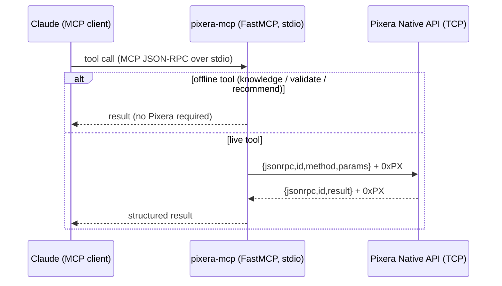
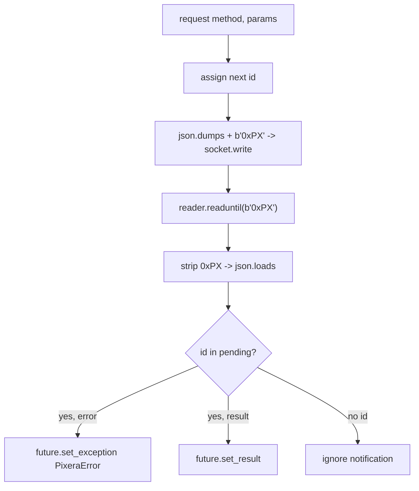
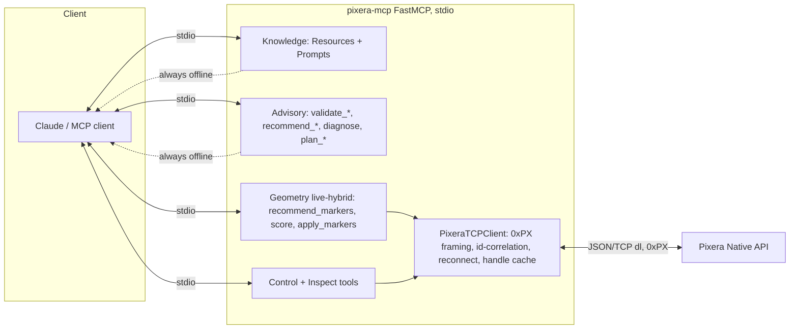
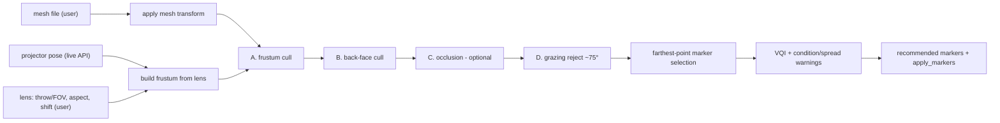

# Pixera MCP Server — Feasibility & Architecture Report

**Project:** `pixera-mcp` — a Model Context Protocol server for AV Stumpfl Pixera.
**Role:** projection-mapping *learning companion* + *marker-calibration advisor* with a live-hybrid
view-cone marker recommender.
**Status:** feasible and implemented (offline knowledge/validation/recommendation; live control/inspection;
live-hybrid geometry). 32 automated tests pass with no Pixera hardware.

---

## 1. Executive summary & verdict

A useful Pixera MCP server is **feasible**, but the value is *not* where a naïve "remote control" design
would put it. Pixera's Native API exposes transport/cues, projector/screen transforms, blackout,
calibration *triggers*, marker writes, and MPCDI loading — but **soft-edge, blend, live warp-grid editing,
projector lens data, and mesh geometry are not exposed**. Therefore the server is built in three layers:

1. **Knowledge + validation + recommendation (offline)** — the largest value. Teaches Pixera projection
   mapping, validates parameters against documented rules ("this is wrong for this workflow"), and
   recommends calibration/warp strategy.
2. **Live control + inspection** — the API subset that *is* actionable.
3. **Live-hybrid view-cone marker recommender** — reads projector **pose** live, and from a user-supplied
   **lens + mesh** computes what each projector sees and where markers should go.

Verdict: **build it offline-first**; treat soft-edge/warp as advisory; make marker calibration the
headline. That is exactly what this repository implements.

---

## 2. Pixera Native API primer

- **Transport:** JSON-RPC 2.0. Modes: JSON/TCP, **JSON/TCP(dl)**, JSON/UDP, HTTP/TCP, Binary/TCP, OSC/UDP.
  Only the JSON/TCP family returns all values reliably. We use **(dl)**.
- **`0xPX` delimiter:** the literal four ASCII characters `0xPX` (bytes `30 78 50 58`) appended directly
  after each JSON message — **not** a hex byte. Frame out = `json + b"0xPX"`; frame in = `readuntil(b"0xPX")`.
- **`id` correlation:** Pixera echoes the request `id`; many requests can be in flight on one socket.
- **Handles:** instance methods take an object `handle` from a getter (e.g. `getProjectorWithName`).
  Handles **invalidate on project reload** → the client clears its cache after `loadProject`.
- **Security:** network-level only — you choose the adapter IP + port in Pixera settings; there is **no
  protocol auth**. Run on a trusted/isolated show LAN and firewall the port.

### Network flow (sequence)

### Delimiter framing & correlation

---

## 3. API-controllable vs UI-only (drives scope)

| Capability | Readable | Writable | Notes |
|---|---|---|---|
| API revision / time / monitoring | ✅ | — | `Utility.*` |
| Timeline transport / cues | partial | ✅ | `Compound.*` (Play=1/Pause=2/Stop=3) |
| Projector pose | ✅ `getPosition/getRotation` | ✅ | metres / Euler degrees |
| Projector lens (FOV/throw/shift) | ❌ | write-only | **user must supply** for view-cone |
| Projector blackout / mapping | ✅ | ✅ | |
| Screen transform | partial | ✅ | getters inconsistent in docs |
| Mesh geometry (verts/faces) | ❌ | ❌ | **parse model file off disk** |
| Marker positions | ❌ | ✅ `setMarkerPositions` | push-in only |
| Warp grid / calibration results | ❌ | run/load only | cannot import existing warp |
| Soft edge / blend / black level | ❌ | ❌ | **UI-only → advisory** |
| Project load/save | — | ✅ | reload invalidates handles |

**Consequence:** "grab warping data per projector" reduces to **grab pose**; lens + mesh come from the user;
existing warp cannot be imported. Soft-edge/warp/feed-mode tools validate and guide, they do not actuate.

---

## 4. Architecture

- Persistent `asyncio` TCP in the FastMCP **lifespan**; a background reader resolves `pending[id]` futures.
- **Offline-first:** knowledge/advisory tools never need Pixera. Geometry/control/inspect tools raise a clear
  "enable JSON/TCP(dl) and set PIXERA_HOST/PORT" error when offline. The geometry subsystem additionally
  requires user-supplied lens + mesh (per the locked decision, it is *live-hybrid only*).

---

## 5. Marker calibration (deep dive)

### Algorithm decision table

| Method | Min points | Surface | Accuracy | Best for |
|---|---|---|---|---|
| Planar homography (DLT) | 4 coplanar | flat | ±0.5–2 px | flat screens |
| **PnP / DLT** | **6 non-coplanar** | any 3D | ±1–5 px | objects, domes (Pixera markers) |
| PnP + bundle adjustment | 8+ | any | ±0.5 px | high-precision multi-projector |
| Structured light (VIOSO) | dense | curved/large | ±0.2–0.5 px | domes, many projectors |
| MPCDI import | n/a | any | as-calibrated | external/vendor |

### The degeneracy rule
Full pose = 6 DoF; each marker = 2 constraints → ≥6 non-coplanar points. **Coplanar markers → 2-fold pose
ambiguity (oscillation); collinear → singular.** Spread markers across faces and depths.

### Pixera specifics
Marker calibration minimises **Re-Projection Error** (UI; target < 1 px @ HD). Prereqs in order: **EDIDs
first**, pre-set lens, accurate 3D model (scan), rough projector placement, output active. ≥5 markers
(6–8 for 3D), in corners. 25.1+: marker colour/size adjustable; 2D/3D positions editable in Inspector.

---

## 6. View-cone marker recommender (the headline feature)

- **Frustum:** `FOV_h = 2·atan(0.5/throw)`, `FOV_v = 2·atan(tan(FOV_h/2)/aspect)`.
- **Cull:** centroid-in-frustum → outward normal toward projector (`dot(normal,view)<0`) → optional ray
  occlusion → grazing reject (incidence > 75° from normal).
- **Placement:** farthest-point sampling for spread; report **condition number** and **3D spread**; warn on
  coplanar/oblique/tiny-visible.
- **VQI** ∈ [0,1] = `visible_area_fraction × mean_incidence × (0.5 + 0.5·spread_3d)` flags poorly
  calibratable projectors.
- **Multi-projector:** faces visible to two projectors are shared-anchor candidates.

---

## 7. MCP surface (schemas)

**Tools (31).** Offline: `pixera_recommend_calibration_method`, `pixera_recommend_warp_method`,
`pixera_diagnose`, `pixera_plan_projection_mapping`, `pixera_validate_softedge`,
`pixera_validate_marker_calibration`, `pixera_validate_canvas_resolution`, `pixera_validate_feed_mode`.
Live-hybrid: `pixera_recommend_markers_for_projector(projector_name, lens, mesh_path, mesh_transform?,
num_markers?, grazing_deg?, do_occlusion?, euler_order?)`, `pixera_score_projector_calibratability`,
`pixera_apply_markers(screen_name, positions[], marker_ids[])`. Live control/inspect: transport, cues,
blackout, calibration, warp-file, project load/save, list/get projectors/screens/timelines/params/time/monitoring.

**Resources (13 + 1 template).** `pixera://guide/{projection-mapping-101,warping,softedge,marker-calibration,
calibration-algorithms,view-cone-methodology,camera-calibration}`, `pixera://reference/{parameters,glossary,
api-capabilities}`, and live `pixera://status`, `pixera://projectors`, `pixera://screens`,
`pixera://timeline/{name}/time`.

**Prompts (5).** `marker_calibration_walkthrough`, `recommend_calibration_strategy`,
`setup_projection_mapping`, `setup_softedge_blend`, `troubleshoot_projection`.

---

## 8. Validation catalog (the "what's wrong" engine)

- **Soft edge:** Feed Areas prerequisite; ~20% overlap; consistent overlaps; all-projectors-selected;
  Dynamic Softedge for 3D; Feed Mode None on flat = error.
- **Marker calibration:** ≥5 (≥6 for 3D); non-coplanar + depth-varied; corner placement; EDID-first;
  lens preset; model-from-scan; Re-Projection-Error thresholds.
- **Canvas:** ≥ projector resolution; aspect match; square pixels.
- **Feed mode:** None only for 3D/non-continuous UV.

Each finding carries `severity`, `message`, `fix`, and a `source` URL.

---

## 9. Risks & constraints

1. **API coverage gap** — soft-edge/warp-grid/feed-mode UI-only over the API. **Partly closed offline:**
   the `.avp` reader (`pixera_import_warp_context`) recovers projector pose, FFD warp grids, marker sets,
   and soft-edge presence directly from the project show-file (reverse-engineered tagged-binary, build 26-1).
   VWF export needs a VIOSO licence; MPCDI is import-only. So warp *context* is now readable from `.avp`
   even though the live API can't provide it.
2. **Coordinate-frame matching (top correctness risk)** — API rotation is Euler degrees with an unstated
   order; `from_euler` defaults to intrinsic ZYX / forward +Z and may need field tuning. `score_projector_
   calibratability` (visible-area %) is a sanity signal; mesh transform must match Pixera's screen placement.
2b. **Handle-method strings** — docs disagree between class-qualified and short forms; we use the rev204
   class-qualified form. Adjust in the client `get_*` helpers if a live install rejects a method (cannot be
   verified offline).
3. **Input fidelity** — recommendations are only as good as the supplied mesh + lens.
4. **Security** — no protocol auth; isolate the network, bind a specific adapter, firewall the port.
5. **Occlusion cost** — O(n²); optional and skipped on very large meshes (logged).
6. **Mesh formats** — OBJ works with the built-in parser; FBX/GLTF/PLY/STL need the `mesh` extra (trimesh).

---

## 10. Future work

- Parse MPCDI/.vwf offline to *import* existing warp/geometry (closes the "grab warp data" gap).
- Direct API high-frequency tracking for live pose dashboards.
- Spatial acceleration (BVH) for occlusion on large meshes.
- Richer monitoring subscriptions; multi-machine (director/clients) awareness.
- An evaluation suite (per the MCP guide) of realistic Pixera tasks.

---

## Sources

- Pixera Native API Introduction; API Quick Start; API Commands; rev204 API comments —
  help.pixera.one, pixera.one/.../api/pixera_api_comments_rev204.txt
- Warping/FeedModes/Softedge; Softedge Creation; Marker Calibration (+ Workflow); Camera-Based Calibration;
  VIOSO 6; UV Maps; Screen Size; EDID Management — help.pixera.one
- OpenCV solvePnP / homography; real-time-rendering frustum & back-face culling; projector throw/FOV references.
